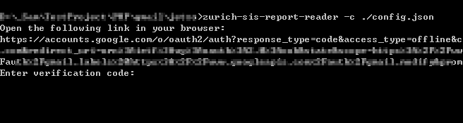
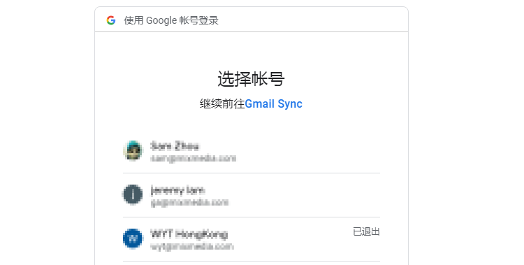
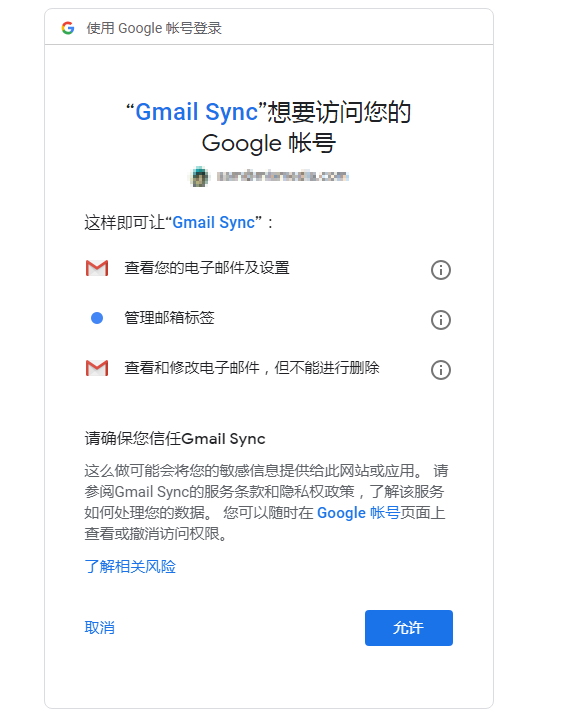
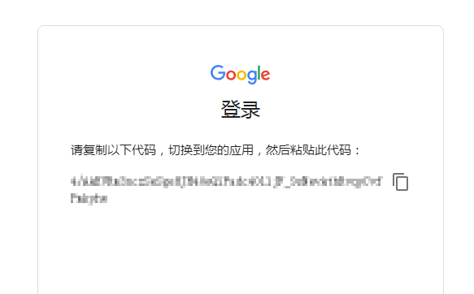

# Zurich-SIS-Report-Reader

通过 Gmail 获取所有的Zurich SIS Report Email 并解压成 `CSV` 文件。

然后导出内部错误report并合并。

## 项目依赖

- [google/apiclient](https://github.com/googleapis/google-api-php-client), [API Ref](https://developers.google.com/resources/api-libraries/documentation/gmail/v1/php/latest/), [Quickstart](https://developers.google.com/gmail/api/quickstart/php)

## 项目运行

- 安装
```
composer global require mmhk/zurich-sis-report-reader:*
```

- 命令行
```bash
Usage: ./zurich-sis-report-reader [options] [operands]

Options:
  -c, --config <arg>   JSON 配置文件位置
  -l, --cache [<arg>]  是否缓存结果
  -?, --help           显示帮助


```

## 配置文件说明

```JS
{
  "credentials-dir": "",    //Gmail API cert 文件存放目录
  "gmail-query": false,     //Gmail 搜索字符串
  "limit": 500,             //分页返回结果数量
  "temp-dir": ""            //临时文件夹用于存放 邮件内容及附件
}
```

## 执行说明

首次执行命令行中会出现提示 访问`url`的提示，这是`Google SDK` 要求`Gmail`账户授权的链接，
根据提示打开链接之后会让你登陆需要访问的`Gmail`账户，然后确认授权。







授权之后会显示一串`token`，请copy `token` 到命令行中，然后`enter`；之后使用的时候就可以跳过授权这个步骤。

